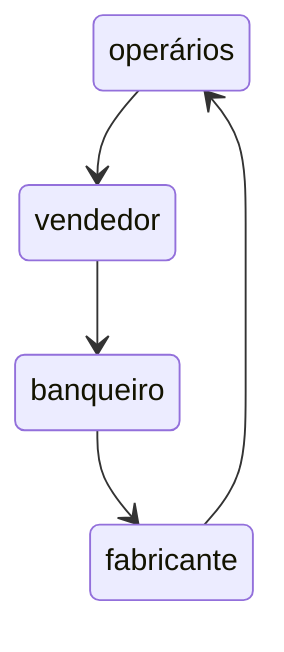

# Salário, Preço e Lucro - Karl Marx


`Informe pronunciado por Marx nos dias 20 a 27 de junho de 1865 nas sessões do Conselho Geral da Associação Internacional dos Trabalhadores`

O texto, no entanto, só foi publicado em 1898
<hr> </hr>

 > 💭 "Reina atualmente no Continente uma verdadeira **epidemia de greves** e se levanta um **clamor geral por aumentos de salários**"

- **John Weston** argumentava que a elevação dos salários não pode melhorar a situação da classe operária.

## I - Produção e Salários
O **Argumento de Weston** se baseava em duas premissas:
1. o _volume da produção nacional é algo de fixo_, uma quantidade ou grandeza constante
2. o _montante dos salários reais é também uma soma fixa_, uma grandeza constante
   
A primeira afirmação é notoriamente falsa, já que o volume da produção cresce ano a ano. Não permanece em estado constante, mas varia continuamente.

Mesmo se o volume da produção fosse algo _fixo_, nada impediria a existência de _variações relativas_ de seus componentes: **salário** e **lucro**.
| Salário | Lucro | Total |
| ------- | ----- | ----- |
|    2    |   6   |   8 	 |
|    6    |   2	  |   8  	|

Dessa forma, não é possível afirmar que o montante de salários é uma soma fixa.

Ademais, se os salários fossem uma quantia fixa, não haveria incentivo para que trabalhadores ou capitalistas buscassem mudanças salariais. No entanto, Marx demonstra a falácia dessa ideia ao observar que os capitalistas frequentemente buscam reduzir os salários, visando a maximização de seus lucros. Da mesma forma, os trabalhadores buscam aumentos salariais, que concretamente podem significar redução da taxa de lucro. Portanto, é compreensível que os trabalhadores busquem esses aumentos.

## II - Produção, Salários e Lucros

Weston diz que o `aumento salarial de 4 xelins para 5 xelins` é meramente _nominal_. O capitalista continua entregando 4 xelins _realmente_, pois o montante dos salários é fixo.

Pois bem. Se o limite do montante dos salários está fixado por uma lei econômica, independente da vontade do capitalista e do operário, faltava a Weston demonstrar essa lei.

Mas, ao contrário, se o limite dado à soma dos salários (neste caso 4 xelins) depende simplesmente da vontade do capitalista, trata-se de um limite arbirtrário. Logo, tanto pode ___variar___ em favor do capitalista ou em favor da classe operária. Portanto, não se pode dizer que é fixo.

ilustra Weston:
> 🥣 "Se uma tigela contém determinada quantidade de sopa, destinada a determinado número de pessoas, a quantidade de sopa não aumentará se aumentar o tamanho das colheres"

Marx o contrapõe, dizendo que a tigela da qual comem os operários contém todo o produto do trabalho nacional. E o que os impede de tirar maior proveito, é exatamete o tamanho das colheres.

Prossegue Marx,
> 💭 "Graças a que artifício consegue o capitalista devolver um valor de 4 xelins por aquilo que vale 5? A alta dos preços das mercadorias que vende."

Logo se questiona: E as variações de preço das mercadorias dependem da vontade do capitalista?

Marx entende que se alteradas as taxas de salários, _ceteris paribus_, haveria repercução no preço das mercadorias pela proporção real entre oferta e demanda.

Uma alta geral na taxa de salários provoca um aumento na procura de bens de primeira necessidade e, consequentemente, um aumento no seus preços de mercado. Os capitalistas deste ramo (de artigos de primeira necessidade) compensariam o aumento de salários através da alta de preços dessas mercadorias. Mas o mesmo não pode ser dito para bens de luxo, por exemplo, que teria os preços _constantes_ já que a procura por estes bens não teria aumentado.

Marx argumenta que os capitalistas de outros ramos (alheios aos de primeira necessidade) logo teriam sua renda diminuída - pelo aumento de salário -, e também procurariam menos por artigos de luxo e, consequentemente, cairiam os preços dessas mercadorias.

- O capital e o trabalho se _deslocariam_ dos ramos menos remunerativos para os que fossem mais.
- Mas assim que operada essa mudança, a taxa geral de lucro voltaria a igualar-se nos diferentes ramos da indústria. Os preços voltariam aos seu antigo nível e _equilíbrio_.
 
Conclui-se que a alta geral da taxa de salários conduzirá a um baixa geral da taxa de lucro.

Marx chama a atenção de Weston para a **Lei das Dez Horas**, promulgada em 1848, em que houve um aumento súbito e obrigatório de salários. Alguns porta-vozes da economia burguesa afirmavam que se tratava de uma sentença de morte para a indústria britânica. Mas o resultado foi diferente, os salários em dinheiro dos operários fabris aumentaram, apesar da redução da jornada de trabalho; cresceu o número de trabalhadores em atividade e baixaram os preços dos produtos. E porque abaixaram os preços? pela expansão das forças produtivas que fez aumentar a oferta de bens.

Esse raciocínio simples, no entanto, não encontra lugar nas argumentações de Weston, já que ele próprio **não concebe uma produtividade do trabalho que não seja fixa.** Weston não concebe aumento na oferta de bens.

## III - Salários e Dinheiro
`Discussão que reaparece no Capítulo 3 de O Capital`

No segundo dia, diz Weston:
> 💵 "Ao verificar-se uma alta geral dos salários em dinheiro, será necessária maior quantidade de **moeda** corrente"

Porém, contrapõe Marx, se o processo de compra e venda se realizar continuamente, não é necessário maior oferta de moeda na economia. Marx traz o exemplo da Inglaterra, em que existia um mecanismo de pagamentos mais aperfeiçoado:
> "Graças à extensão e à concentração do sistema bancário, __necessita-se de muito menos moeda__ para por em circulação a mesma quantidade de valores e realizar o mesmo ou um maior número de negócios"

Esta é a circulação que performa nesse sistema:


Dessa forma, é possivel lidar com o valor e o volume da produção normalmente mesmo com uma baixa quantidade de moeda na economia, desde que exista um circuito contínuo e repetitivo que faça a moeda circular.
## IV - Oferta e Procura
A oferta e a procura só regulam as oscilações temporárias dos preços no mercado. Mas não explicam jamais esse valor em si mesmo.
## V - Salários e Preços
A ideia de Weston se traduz assim:
> "os preços das mercadorias são determinados ou regulados pelos salários".

Há de se lembrar que salário é um nome especial para `preço da força de trabalho`. Se Weston diz que os salários regulam o preço das mercadorias, então se os salários sobem os preços deveriam subir. Bom, se o salário real são todas as mercadorias que se pode conseguir em troca, então o o preço das mercadorias também determinam o valor da força de trabalho. Portanto, chega-se a um circulo vicioso.

Marx ironiza a frase "os salários determinam os preços das mercadorias", afirmando que é equivalente a dizer que _"o valor se determina pelo valor"_. Marx, ainda, menciona **Ricardo e Smith** como economistas contrários a esta visão antiquada de Weston. Isso se deve pelo fato de estes autores entenderem que o que determina o valor de uma mercadoria é o tempo de trabalho e não o valor de outra mercadoria.
## VI - Valor e Trabalho
Nesse capítulo, Marx parece inaugurar raciocínios que viriam à ser discutidos em _O Capital_.

> "O que é o valor da mercadoria?"
> "Como se determina este valor?"

A primeira vista, parece que o valor de uma mercadoria é sempre relativo, que exige uma relação comparativa com outra mercadoria. Mas dizer que um _quarter_ de trigo se troca por uma quantidade x de ferro, é dizer que ambos são iguais a __uma terceira coisa__, que não é trigo, nem ferro. Esta terceira coisa é a medida comum de ambos.

- Qual a substância social comum a todas as mercadorias? É o __trabalho__.
Mas não simplesmente trabalho, mas _trabalho social_. Aquele que produz um objeto para seu uso pessoal e direto, para consumi-lo, cria um produto, mas não uma mercadoria.

Uma mercadoria tem um valor por ser uma cristalização de um trabalho social.

> 💭 "As quantidades correspondentesde mercadorias, que foram produzidas no mesmo tempo de trabalho, são iguais. Ou, dito de outro modo, o valor de uma mercadoria está para o valor de outra, assim como a quantidade de trabalho plasmada numa está para a quantidade de trabalho plasmada na outra."

Marx prossegue combatendo a ideia de determinação do valor com base no salários. Pois o salário é completamente indiferente para determinar o Valor. Não faz diferença o quão alto é o salário do trabalhador, na verdade, inclusive, não faz diferença mesmo que seja trabalho escravo. É claro que os salários não podem ser maiores que os valores das mercadorias por eles produzidas, não podem ser maiores pois isto significaria falência. Mas o contrário pode acontecer, os salários podem ser inferiores em todos os graus imagináveis.

Logo, os salários estarão limitados pelos produtos, mas os valores dos produtos não estão limitados pelos salários.

Marx prossegue:
> "Poderia parecer que, se o valor de uma mercadoria se determina pela quantidade de trabalho que se inverte na sua produção, __quanto mais preguiçoso ou inábil seja um operário, mais valiosa será a mercadoria__
> (...)
> Lembrai-vos que eu empregava a expressão 'trabalho social'"

 A produção semre se dá num dado estado social e sob determinadas condições sociais médias. Quando o tear a vapor começou a competir com o tear manual, o pobre tecelão manual tinha que trabalhar 17 ou 18 horas, em vez de 9 ou 10 como antes. Mas suas mercadoria não valem 18 horas, mas 10.

> "Se então a quantidade de trabalho socialmente necessário, materializado nas mercadorias, é o que determina o valor de troca destas, ao crescer a quantidade de trabalho exigível para produzir uma mercadoria aumenta necessariamente o seu valor e, vice-versa, diminuindo aquela, baixa este."

Até aqui Marx só falou do __valor__, mas ele ele também aborda o __preço__.

> "O preço é a expressão em dinheiro do valor"

Na Inglaterra se usava preços-ouro, enquanto no Continente se usava preços-prata. O Valor do ouro, ou da prata, também se determina pela quantidade de trabalho necessário à sua extração. 

> "Na medida em que é apenas a expressão em dinheiro do valor, o preço foi denominado _preço natural_, por Adam Smith, e _prix nécessaire_, pelos fisiocratas franceses"

Afirmava __Adam Smith__, em _A Riqueza das Nações_:


> "O preço natural é... o preço central em torno do qual gravitam constantemente os preços das mercadorias. Circunstâncias diversas os podem manter erguidos muito acima desse ponto e, por vezes, precipitá-los um pouco abaixo. Quaisquer, porém, que sejam os obstáculos que os impeçam de se deter neste centro de repouso e estabilidade, eles tendem continuamente para lá."

Se a oferta e a procura se equilibram, os preços das mercadorias no mercado corresponderão, portanto, a seus preços naturais. E a oferta e demanda devem constantemente tender ao equilibrio.

⭐É absurdo supor que o lucro brota da majoração dos preços das mercadorias, ou do fato de que se vendam por um preço que considerevalmente o seu valor. (O valor nasce na produção e não na circulação)

O absurdo se nota quando generelizamos. Se todos os comerciantes resolvessem aumentar o preço do seus produtos, ganhariam como vendedores, e perderiam como compradores.

Marx encessa o capítulo:
> Portanto, para explicar o caráter geral do lucro não tereis outro remédio senão partir do teorema de que as mercadorias se vendem, em média, pelos seus verdadeiros valores e que os lucros se obtêm vendendo as mercadorias pelo seu valor, isto é, em proporção à quantidade de trabalho nelas materializado.
Se não consegue explicar o lucro sobre esta base, de nenhum outro modo conseguirá explicá-lo.
> Isto parece um paradoxo e contrário à observação de todos os dias.
> Parece também paradoxal que a Terra gire ao redor do Sol e que a água seja formada por dois gases altamente inflamáveis. As verdades científicas serão sempre paradoxais, se julgadas pela experiência de todos os dias, a qual somente capta a aparência enganadora das coisas.

## VII - Força de trabalho
Diz Marx:
> "O que o operário vende não é diretamente o seu trabalho, mas a sua força de trabalho, cedendo temporariamente ao capitalista o direito de dispor dela"

Qual a origem desse fenômeno em que alguns tem terras, maquinarias, matérias-primas e outros não possui nada além da sua força de trabalho? Alguns economistas chamam de "acumulação prévia ou originária", mas deveria se chamar __expropriação originária__. 
- __acumulação originária:__ série de processos históricos que resultaram na decomposição da unidade originária existente entre o homem trabalhador e seus intrumentos de trabalho.

> "Que é, pois, o valor da força de trabalho?
>
> Como o de toda outra mercadoria, este valor se determina pela quantidade de trabalho necessário para produzi-la. A força de trabalho de um homem consiste, pura e simplesmente, na sua individualidade viva"

O valor da força de trabalho é determinado pelo valor dos artigos de primeira necessidade exigidos para produzir, desenvolver, manter e perpetuar a força de trabalho.
## VIII - A Produção da Mais-valia
Aqui Marx apresenta uma discussão interessante pois ele distingue o valor da força de trabalho e o valor por ela criado. 
Se um fiandeiro vende sua força de trabalho por 3 xélins diários, ou 18 semanais, vende pelo seu valor. Se em 6 horas este mesmo fiandeiro produz 3 xélins, o valor gerado é equivalente ao seu salário. Nesta situação não existe mais-valia. Nota-se aqui um problema.
O fiandeiro deverá trabalhar mais horas para que o capitalista consiga extrair a mais-valia.
## IX - O valor do trabalho
Se o preço de sua força de trabalho é 3 xelins, nos quais se materializam 6 horas de trabalho, e o fiandeiro trabalha 12 horas, este operário pensará que esses 3 xelins valem suas 12 horas de trabalho, mas na verdade estas 12 horas representem um valor de 6 xelins. Aqui se chega a um duplo resultado:

1. O **valor da força de trabalho toma a aparência do valor do próprio trabalho.**
2. Ainda que só se pague uma parte do trabalho diário do operário, enquanto a outra parte fica sem remuneração, e ainda que este trabalho não remunerado seja precisamente o fundo de que se forma a mais-valia ou lucro, **fica parecendo que todo o trabalho é trabalho pago.**

Essa separação, trabalho pago e trabalho não-pago, era mais visível no feudalismo, com a _renda-trabalho_ em que o servo tirava dias da seman para trabalhar de graça na gleba do senhor e nos outros dias trabalha para si próprio em sua parcela. Mas isto se perdeu no capitalismo por um disfarce.

## X - O Lucro Obtém-se Vendendo uma Mercadoria pelo seu Valor
Exemplo que Marx dá:
|     Horas    |        Xelins        | 
|  ----------  |     ----------       |
|    6 horas   | 3 xelins (salário)   |
|    6 horas   | 3 xelins (mais-valia)|
|   12 horas   | 6 xelins (total)     |

Neste exemplo, também, o produto final custa 18 xelins, __sendo 12 xelins o valor já previamente incorporado nas matérias-primas, maquinaria, etc.__
Ao vender a mercadoria pelo seu valor, 18 xelins, o capitalista obtém, portanto, um valor de 3 xelins.
Esses 3 xelins não foram obtidos por vender sua mercadoria a um preço que exceda o seu valor, mas por vendê-la por seu valor real. O valor de uma mercadoria se determina pela quantidade total de trabalho que encerra. (neste caso, 12 xelins de trabalho morto + 6 xelins de valor gerado)
## XI - As Diversas Partes em que se Divide a Mais-valia
`Discussão que reaparece no Livro 3 de O Capital`

Em termos sumários, essa é a distribuição possível da mais-valia.

```mermaid
classDiagram
      Valor --|> Salário
      Valor --|> Mais_valia
      Mais_valia --|> Renda_da_Terra
      Mais_valia --|> Juro
      Mais_valia --|> Lucro
      
  
      class Valor{Gerado pelo trabalhador}
      class Salário{pago ao trabalhador}
      class Mais_valia{capturado pelo capitalista}
      class Renda_da_Terra{
       paga pelo uso da terra
       (ao latifundiário)
      }
      class Juro{
        pago pelo uso do dinheiro
        (ao banco)
      }
      class Lucro{
       resta nas mãos
       (do capitalista)
      }
```
## XII - A Relação Geral entre Lucros, Salários e Preços
Marx entende que existe trabalho pretérito, isto é, valor cristalizado nas matérias-primas. E chama atenção para desconsidera-lo dos cálculos para entender o trabalho pago e não pago com base no valor gerado pelo trabalhador.

Como o capitalista e o operário só podem dividir um valor limitado, quanto mais um recebe, menos o outro receberá e vice-versa. Uma parte aumenta nas mesma proporção que a outra diminui.

Ao final, usando exemplo de uma fabrica, Marx esclarece que o preço de um fio é determinado pelo _valor total que encerra_ (isto é, valor pretérito + valor atual gerado) e não somente pelo valor gerado (que pode se dividir entre trabalho pago e não pago.
## XIII - Casos Principais de Luta pelo Aumento de Salários ou Contra a sua Redução
1. o valor da força de trabalho é determinado pelo valor dos artigos de primeira necessidade, se o salário não sobe ou não fica em proporções suficientes para compensar o aumento do preço dos artigos de primeira necessidade, o preço do trabalho descerá abaixo do valor do trabalho e o padrão de vida do trabalhador piorará.

2. O valor dos artigos de primeira necessidade e dos salários podem até permanecer invariáveis, ainda que o preço deles em dinheiro sofra alteração. A descoberta de jazidas mais abundantes de ouro, por exemplo, reduziu o valor do ouro e aumentou _nominalmente_ o preço das mercadorias. O que antes custava uma onça, agora custa duas onças.

Mas se o preço em dinheiro do salário também não aumenta, não acompanha a subida de preços, quem ganha é o Capital.
> 💸 "Toda a história do passado prova que sempre que se produz uma depreciação do dinheiro, os capitalistas se aprestam para tirar proveito da conjuntura e enganar os operários"

3. Marx ainda fala sobre as jornadas de trabalho e a leis que vigoraram até o século 18, em que exploravam ao máximo os limites físicos da força de trabalho, exigindo 12, 14 horas no trabalho. Crianças menores de 12 anos, inclusive, trabalhavam 12 horas por dia.

Os operários ao buscr redução da jornada de trabalho não fazem mais que cumprir um dever para com eles mesmos.

> ♠ "O homem que não dispõe de nenhum tempo livre, cuja vida, afora as interrupções puramente físicas do sono, das refeições, etc., está toda ela absorvida pelo seu trabalho para o capitalista, é menos que uma besta de carga. É uma simples máquina, fisicamente destroçada e espiritualmente animalizada, para produzir riqueza alheia"

4. A produção capitalista é movida por fases e cíclos periódicos. Passa por fases de calma, animação crescente, prosperidade, superprodução, crise e estagnação. Durante a fase de prosperidade, na qual o capitalista obtém lucros extraordinários, seria uma absurdo exigir que o operário renunciasse ao direto de ser compensado. 


## XIV - A Luta Entre o Capital e o Trabalho e seus Resultados
 Marx demostrou ao longo de todo o texto que o aumento geral dos salários resultaria numa diminuição geral da taxa de lucro, sem afetar, porém, os preços médios das mercadorias.
